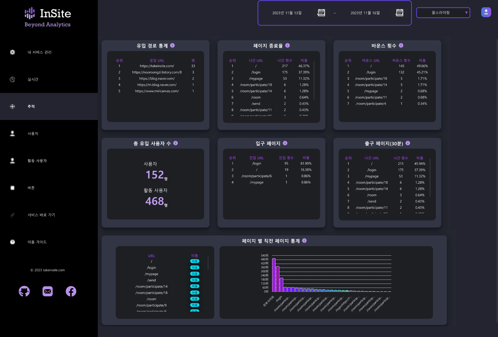

# A701 Thirty(Insite - 꿀스라이팅)

## Priview


> 인사이트 : GA보다 사용하기 편리한 **웹사이트 분석 대시보드**<br/>
꿀스라이팅: 개봉일을 정하고, 서로에게 편지를 쓰는 **롤링페이퍼** 사이트(+ 인사이트 분석 테스트 사이트)


## 주요 기능

### 인사이트

- 실시간 웹 사이트 분석 기능
- 웹 사이트 추적 기능
- 사용자 정보 파악 기능
- 활동 사용자 파악 기능
- 버튼 액션 파악 기능

<hr/>


## 세부 기능

|메인 기능|기능명|상세 설명|
|:------------|:-------------------|:-------------------------------------------------------- |
|1. 실시간 페이지|1-1. 실시간 사용자|최근 30분 내 사용자들이 서비스 내 이용한 페이지를 그래프로 나타냅니다. 전체 서비스 중 어떤 페이지가 많이 사용됐는지 비율로 확인할 수 있고, 실시간 갱신되어 현재 유저들이 어떤 페이지를 사용하고 있는지 파악할 수 있습니다.|
||1-2. 실시간 페이지 이용 통계|최근 30분 내 사용자들이 서비스 내 이용한 페이지에 대한 정보를 나타냅니다. 많이 사용된 페이지 순서대로 확인할 수 있고, 해당 페이지의 렌더링 시간 또한 파악할 수 있습니다.|
||1-3. 유입 경로 통계| 최근 30분 내 유입 경로 통계를 제공합니다. 어떤 플랫폼에서 해당 서비스로 유입되었는지 판단할 수 있는 정보를 제공합니다. 주로 유입되는 경로를 파악해 서비스를 홍보할 때 이용할 수 있습니다.|
||1-4. 버튼 통계| 최근 30분 내 버튼 통계를 제공합니다. 서비스 내 버튼 클릭 횟수와 평균 클릭 횟수 정보를 제공합니다. 이를 통해 서비스 내 버튼 활용도를 파악해 서비스 개선에 적용할 수 있습니다. |
||1-5. 트래픽 공격 감지| 최근 30분 내 트래픽 공격을 감지합니다. 기준 시간 내 특정 쿠키 ID가 서비스에 대량으로 요청을 보낼 경우를 판단합니다. 이를 통해 서비스로의 공격을 판단하여 서비스에 대한 보안 대책을 강구할 수 있습니다.|
|2. 추적 페이지|2-1. 유입 경로 통계|설정된 기간 내 유입 경로 통계를 제공합니다. 기간 내 모든 유입 데이터를 근거로 데이터를 생성하여 사용자의 설정에 따라 효과적인 유입 경로 통계를 제공합니다.|
||2-2. 페이지 종료율|설정된 기간 내 페이지 종료율을 제공합니다. 페이지 사용자의 활동이 종료된 마지막 페이지에 대한 데이터로써 서비스를 종료한 페이지를 내림차순으로 제공하여 서비스 개선에 적용할 수 있습니다.|
||2-3. 바운스 횟수|설정된 기간 내 바운스 횟수를 제공합니다. 사용자가 특정한 활동없이 페이지에 유입되자 마자 서비스를 종료했을 경우를 판단한 정보를 제공하여 서비스개선에 적용할 수 있습니다.|
||2-4. 총 유입 사용자 수|기간 내 유입된 모든 새로운 사용자 수와 활동 사용자 수 정보를 제공합니다. 사용자수는 Cookie Id기반이며, 활동 시간에 따라 각각의 Cookie Id는 ActivityId를 부여 받아 각각의 활동 정보가 기록됩니다.|
||2-5. 입구 페이지|기간 내 입구 페이지 정보를 제공합니다. 서비스로의 진입 페이지 정보로써 어떤 페이지에서 해당 서비스를 시작했는지 확인할 수 있습니다.|
||2-6. 출구 페이지|기간 내 최근 30분을 제외한 데이터를 기반으로 출구 페이지 정보를 제공합니다. 서비스로의 출구 페이지 정보로 어떤 페이지에서 해당 서비스로부터 나갔는지 확인할 수 있습니다.|
||2-7. 페이지 별 직전 페이지 통계| 기간 내 직전 페이지에 대한 정보를 제공합니다. 각 페이지 별 직전 페이지에 대한 정보를 그래프로 제공하여 어떤 페이지에서 해당 페이지로 넘어왔는지 확인할 수 있습니다.|
|3. 사용자 페이지|3-1. 사용자 수 조회|기간 내 각 페이지 별 기록된 사용자의 수를 그래프를 통해 확인할 수 있습니다. 어떤 페이지에서 가장 많은 사용자가 존재하는지 파악해 서비스 개선에 적용할 수 있습니다.|
||3-2. 페이지 조회 수| 기간 내 서비스 페이지에 대한 조회수를 내림차순으로 제공합니다. 어떤 페이지에서 가장 많은 사용자가 존재하는지 파악해 서비스 개선에 적용할 수 있습니다.|
||3-3. 비정상적 사용자 접근 내역|기간 내 비정상적 사용자 접근 내역 데이터를 제공합니다. 기준 시간 내 특정 쿠키 ID가 서비스에 대량으로 요청을 보낼 경우를 판단합니다. 이를 통해 서비스로의 공격을 판단하여 서비스에 대한 보안 대책을 강구할 수 있습니다.|
||3-4. 사용자 별 페이지 조회수| 기간 내 사용자 별 페이지 조회수를 제공합니다. 서비스 전체 사용자수와 함께 사용자 별 페이지 조회수를 파악할 수 있습니다. 사용자 개개인이 어떤 페이지를 사용하는지 구체적으로 파악할 수 있습니다.|
|4. 활동 사용자|4-1. 활동 사용자 수 조회| 기간 내 활동 사용자 수 조회 정보를 제공합니다. 각 페이지 별 활동 사용자 수를 내림차순으로 제공함으로써 활동 사용자들이 어떤 페이지를 많이 사용하는지 파악할 수 있습니다.|
||4-2. 평균 체류 시간|기간 내 활동 사용자 별 평균 체류 시간 정보를 제공합니다. 활동 사용자들이 어떤 페이지에서 오래 머무르는지 파악해. 서비스 개선에 적용할 수 있습니다.|
||4-3. 사용자 당 활동 횟수|기간 내 사용자 별 페이지에 따른 평균 활동 횟수를 제공합니다. 어떤 페이지에 사용자가 자주 방문하는지 파악하여 서비스 개선에 적용할 수 있습니다.|
||4-4. 총 사용자 수| 기간 내 전체 사용자 수와 활동 사용자 수를 제공합니다. Cookie Id기반의 사용자 수와 활동 시간에 따라 부여된 Activity Id로 나뉜 활동 사용자 수를 파악할 수 있습니다.|
||4-5. OS 별 활동 사용자 수|기간 내 어떤 운영체제를 통해 해당 서비스에 접근했는지 파악할 수 있습니다. 서비스를 제공하는 플랫폼 확장 계획에 적용할 수 있습니다.|
||4-6. 활동당 페이지 조회수|기간 내 페이지 별 전체 활동 횟수와 활동 사용자 별 평균 활동 횟수를 제공합니다. 활동 사용자가 자주 사용하는 페이지를 파악할 수 있어 서비스 개선에 적용할 수 있습니다.|
||4-7. 시간 별 활동 사용자 수| 기간 내 시간대 별 활동 사용자 수를 제공합니다. 시간대에 따라 서비스를 이용하는 활동 사용자 수를 파악할 수 있어 패치 시간 설정 등에 적용할 수 있습니다.|
|5. 버튼 페이지|5-1. 버튼 통계| 기간 내 버튼 이용 통계를 제공합니다. 어떤 버튼이 자주 활용되고, 어떤 이벤트가 자주 발생하는지 파악할 수 있습니다. 서비스 개선에 적용할 수 있습니다.| 
||5-2. 버튼 클릭 로그| 기간 내 버튼 클릭 로그와 사용자당 버튼 클릭 평균 횟수를 확인할 수 있습니다. 버튼 이벤트 개선에 적용할 수 있습니다.|
||5-3. 버튼 누른 횟수| 기간 내 전체 이용자가 버튼을 클릭한 횟수를 그래프로 파악할 수 있습니다. 버튼 클릭 추이를 확인하여 버튼 이벤트 개선에 적용할 수 있습니다.|

## 아키텍처

### 인사이트


<hr/>

## 설치

[포팅 메뉴얼](./exec/포팅_메뉴얼.docx) 참조

## 사용 예시

사용 예시는 [Insite 시나리오](./exec/Insite_시연시나리오.pdf)를 참조하세요


## 개발 설정

- OS: Windows 10 Pro
- Language: Java 11
- Code Editor: IntelliJ, Visual Studio Code

## 릴리즈 히스토리

* 1.0.0
* Project Transfer (프로젝트 이관)

## 기여

1. 해당 프로젝트를 Fork 하세요. (https://lab.ssafy.com/ssafy_opensource/9th_insite/-/forks/new)
    * **Project URL**은 개인 Gitlab ID로 설정해주세요!
    * **Project slug**는 변경하지 않습니다.
2.  새로운 브랜치를 생성하세요.
    *   이때 브랜치는 `dev`브랜치에서 분기해주세요.
    *   브랜치 네이밍은 `기수_팀코드_학번`으로 설정합니다.    
    *   ```
        git checkout -b dev  
        git pull origin dev  
        git checkout -b 10th_A101_1011111
3.  변경사항을 commit 하세요 (`git commit -am 'Add some fooBar'`)
4.  브랜치에 Push 하세요 (`git push origin 10th_A101_1011111`)
5.  새로운 Merge Request를 요청하세요
    *   Source branch: `개인ID/프로젝트`에서 새로 생성한 브랜치(`10th_A101_1011111`)
    *   Target branch: `ssafy_opensource/프로젝트` 의 `dev` 브랜치
    *   Description에 수정된 파일의 위치와 변경 사항, 의견 등을 작성해 등록합니다.


## 라이선스

Distributed under the SGPL license. See [License](LICENSE) for more information.

## 사용 화면





